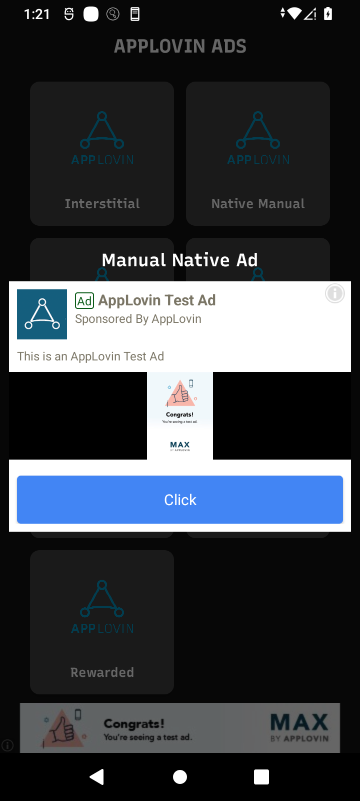

# Applovin-Ads

## Description

This project implements various types of ads provided by Applovin, including:

- Interstitial Ads
- Native Manual Ads
- Native Ad Placement
- Native Templates
- Banner Ads
- App Open Ads
- Reward Ads

It also features day and night modes for a more versatile user experience.

## Screenshots

            

## Features

- Interstitial Ads: Full-screen ads that appear at natural transition points in your app.
- Native Manual Ads: Customizable native ads integrated manually for seamless user experience.
- Native Ad Placement: Strategically placing native ads for optimal user engagement and visibility.
- Native Templates: Pre-defined layouts for native ads to maintain consistent design across the app.
- Banner Ads: Horizontal ads typically placed at the top or bottom of the screen.
- App Open Ads: Ads are shown when the app is launched, providing immediate visibility to users.
- Reward Ads: Users receive incentives, like in-app currency, for engaging with these ads.
- Day/Night Modes: Toggle between light and dark themes for enhanced user comfort and accessibility.

## Usage
Explain how to integrate and use the different ad types in your app. Provide code snippets, steps, or any other relevant information.
1. Interstitial Ads
```bash
    private var interstitialAd: MaxInterstitialAd? = null
interstitialAd = MaxInterstitialAd(activity.getString(R.string.applovinInterstitial), activity)
        requestNewInterstitial(interstitialAd!!)
        if (interstitialAd!!.isReady) {
            interstitialAd!!.showAd()
            interstitialAd!!.setListener(object : MaxAdViewAdListener {
                override fun onAdExpanded(ad: MaxAd) {}
                override fun onAdCollapsed(ad: MaxAd) {
                    Log.d(TAG, "onAdCollapsed: ")

                }

                override fun onAdLoaded(ad: MaxAd) {
                    Log.d(TAG, "onAdLoaded: ")
                }

                override fun onAdDisplayed(ad: MaxAd) {}
                override fun onAdHidden(ad: MaxAd) {
                    requestNewInterstitial(interstitialAd!!)
                    Log.d(TAG, "onAdHidden: ")

                }

                override fun onAdClicked(ad: MaxAd) {}
                override fun onAdLoadFailed(adUnitId: String, error: MaxError) {
                    requestNewInterstitial(interstitialAd!!)
                    Log.d(TAG, "onAdLoadFailed: ")
                }

                override fun onAdDisplayFailed(ad: MaxAd, error: MaxError) {
                    requestNewInterstitial(interstitialAd!!)
                    Log.d(TAG, "onAdDisplayFailed: ")
                }
            })
        }
```
2. Native Manual Ads
```bash
  private fun createNativeAdView(
        context: Activity,
        nativeAdLayout: FrameLayout
    ): MaxNativeAdLoader {

        val binder: MaxNativeAdViewBinder =
            MaxNativeAdViewBinder.Builder(R.layout.manual_native_view)
                .setTitleTextViewId(R.id.title_text_view)
                .setBodyTextViewId(R.id.body_text_view)
                .setAdvertiserTextViewId(R.id.advertiser_text_view)
                .setIconImageViewId(R.id.icon_image_view)
                .setMediaContentViewGroupId(R.id.media_view_container)
                .setOptionsContentViewGroupId(R.id.options_view)
                .setStarRatingContentViewGroupId(R.id.star_rating_view)
                .setCallToActionButtonId(R.id.cta_button)
                .build()
        nativeAdView = MaxNativeAdView(binder, context)
        nativeAdLoader =
            MaxNativeAdLoader(context.getString(R.string.applovinNativeManual), context)

        nativeAdLoader!!.setNativeAdListener(object : MaxNativeAdListener() {
            override fun onNativeAdLoaded(nativeAdView: MaxNativeAdView?, ad: MaxAd) {
                if (nativeAd != null) {
                    Log.d(TAG, "ifNativeAdIsNotNull: ")
                    nativeAdLoader!!.destroy(nativeAd)
                }

                nativeAd = ad
                nativeAdLayout.removeAllViews()
                nativeAdLayout.addView(nativeAdView)
            }

            override fun onNativeAdLoadFailed(adUnitId: String, error: MaxError) {
            }

            override fun onNativeAdClicked(ad: MaxAd) {

            }

            override fun onNativeAdExpired(ad: MaxAd) {
            }

        })
        return nativeAdLoader as MaxNativeAdLoader
    }
```
3. Native Ad Place
```bash
  val settings = MaxAdPlacerSettings(getString(R.string.applovinNativeSmall))
        settings.addFixedPosition(2)
        settings.addFixedPosition(5)
        settings.repeatingInterval = 5

        adapter = AdPlacerAdapter(adPlacerList)
        adAdapter = MaxRecyclerAdapter(settings, adapter, requireActivity())

        adAdapter.setListener(object : MaxAdPlacer.Listener {
            override fun onAdLoaded(position: Int) {
            }

            override fun onAdRemoved(position: Int) {
            }

            override fun onAdClicked(ad: MaxAd?) {
            }

            override fun onAdRevenuePaid(ad: MaxAd?) {}
        })

        binding.recyclerView.adapter = adAdapter
        binding.recyclerView.setHasFixedSize(true)
        adAdapter.loadAds()
```
4. Native Templates Ad
```bash
    private fun showNativeTemplate(context: Activity, nativeAdContainer: FrameLayout) {
        nativeAdLoader =
            MaxNativeAdLoader(context.getString(R.string.applovinNativeMedium), context)
        nativeAdLoader!!.setNativeAdListener(object : MaxNativeAdListener() {

            override fun onNativeAdLoaded(nativeAdView: MaxNativeAdView?, ad: MaxAd) {
                if (nativeAd != null) {
                    nativeAdLoader!!.destroy(nativeAd)
                }

                nativeAd = ad

                // Add ad view to view.
                nativeAdContainer.removeAllViews()
                nativeAdContainer.addView(nativeAdView)
            }

            override fun onNativeAdLoadFailed(adUnitId: String, error: MaxError) {
            }

            override fun onNativeAdClicked(ad: MaxAd) {
            }
        })
        nativeAdLoader!!.loadAd()
    }

```
5. Banner Ad
```bash
    override fun createBannerAd(context: Activity, banner: FrameLayout) {
        adView = MaxAdView(context.getString(R.string.applovinBanner), context)

        /*if you want to set background color.
            adView?.setBackgroundColor(...)
         */
        banner.addView(adView)
        adView!!.loadAd()
        adView!!.startAutoRefresh()
        adView!!.setListener(object : MaxAdViewAdListener {
            override fun onAdLoaded(p0: MaxAd?) {
                Log.d(TAG, "onAdLoaded: Banner")
            }

            override fun onAdDisplayed(p0: MaxAd?) {
                Log.d(TAG, "onAdDisplayed: Banner")
            }

            override fun onAdHidden(p0: MaxAd?) {
                Log.d(TAG, "onAdHidden: Banner")
            }

            override fun onAdClicked(p0: MaxAd?) {
                Log.d(TAG, "onAdClicked: Banner")
            }

            override fun onAdLoadFailed(p0: String?, p1: MaxError?) {
                Log.d(TAG, "onAdLoadFailed: Banner ${p1!!.message}")
            }

            override fun onAdDisplayFailed(p0: MaxAd?, p1: MaxError?) {
                Log.d(TAG, "onAdDisplayFailed: Banner ${p1!!.message}")
            }

            override fun onAdExpanded(p0: MaxAd?) {
                Log.d(TAG, "onAdExpanded: Banner")
            }

            override fun onAdCollapsed(p0: MaxAd?) {
                Log.d(TAG, "onAdCollapsed: Banner")
            }

        })
    }
```
6. App Open Ad
```bash
class AppOpenManager(applicationContext: Context) : LifecycleObserver, MaxAdListener {
    private var appOpenAd: MaxAppOpenAd
    private var context = applicationContext


    init {
        ProcessLifecycleOwner.get().lifecycle.addObserver(this)
        context.let {
            appOpenAd = MaxAppOpenAd(context.getString(R.string.applovinOpen), it)
            appOpenAd.setListener(this)
            appOpenAd.loadAd()
        }
    }

    fun showAdIfReady() {
        if (!AppLovinSdk.getInstance(context).isInitialized) return
        appOpenAd?.let {
            if (appOpenAd.isReady) {
                appOpenAd.showAd()
            } else {
                appOpenAd.loadAd()
            }
        }
    }

    @OnLifecycleEvent(Lifecycle.Event.ON_START)
    fun onStart() {
        showAdIfReady()
    }

    override fun onAdLoaded(ad: MaxAd) {
    }

    override fun onAdLoadFailed(adUnitId: String, error: MaxError) {
        appOpenAd.loadAd()
    }

    override fun onAdDisplayed(ad: MaxAd) {
        appOpenAd.loadAd()
    }

    override fun onAdClicked(ad: MaxAd) {}

    override fun onAdHidden(ad: MaxAd) {
        appOpenAd.loadAd()
    }

    override fun onAdDisplayFailed(ad: MaxAd, error: MaxError) {
        appOpenAd.loadAd()
    }

}
```
7. Reward Ad
```bash
class RewardedAds(private val context: Activity) : MaxRewardedAdListener {
    private lateinit var rewardedAd: MaxRewardedAd
    private var retryAttempt = 0.0


    fun createRewardedAd() {
        rewardedAd = MaxRewardedAd.getInstance(context.getString(R.string.applovinReward), context)
        rewardedAd.setListener(this)
        rewardedAd.loadAd()
        if (rewardedAd.isReady) {
            rewardedAd.showAd()
        } else {
            Toast.makeText(
                context,
                context.getString(R.string.reward_ad_is_not_ready_yet), Toast.LENGTH_SHORT
            ).show()
        }
    }

    override fun onAdLoaded(maxAd: MaxAd) {
        retryAttempt = 0.0
    }

    override fun onAdLoadFailed(adUnitId: String?, error: MaxError?) {
        Toast.makeText(context, error!!.message.toString(), Toast.LENGTH_SHORT).show()
        retryAttempt++
        rewardedAd.loadAd()
    }

    override fun onAdDisplayFailed(ad: MaxAd?, error: MaxError?) {
        rewardedAd.loadAd()
    }

    override fun onAdDisplayed(maxAd: MaxAd) {}

    override fun onAdClicked(maxAd: MaxAd) {}

    override fun onAdHidden(maxAd: MaxAd) {
        rewardedAd.loadAd()
    }

    override fun onRewardedVideoStarted(maxAd: MaxAd) {}

    override fun onRewardedVideoCompleted(maxAd: MaxAd) {

    }

    override fun onUserRewarded(maxAd: MaxAd, maxReward: MaxReward) {

    }
}
```

## Installation
```bash
Clone the repository and run the app in your IDE:
```
[Clone repository to run app](https://github.com/UmairOye/Applovin-Ads.git) 
```bash
you can download whole code as zip file:
```
[Click here to download code as zip](https://github.com/UmairOye/Applovin-Ads/archive/refs/heads/main.zip) 
```bash
or download demo app for testing purpse:
```
[Download Demo App](https://github.com/UmairOye/Applovin-Ads/releases/download/release/app-debug.apk)

## How to Contribute
If you would like to contribute to the project, follow these steps:


1. Fork the repository
2. Create a new branch (`git checkout -b feature/your-feature`)
3. Make your changes and commit them (`git commit -m 'Add some feature'`)
4. Push to the branch (`git push origin feature/your-feature`)
5. Create a pull request

## Don't Forget to Star ⭐

If you found this project useful or had fun exploring it, please consider giving it a star. It's a great way to show your appreciation and it puts a smile on my face! 😊🌟
